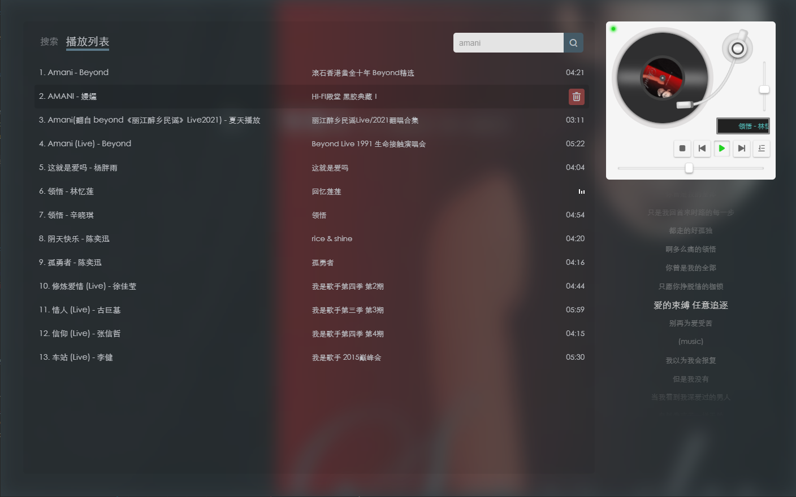

# 唱片播放器（record-player）

## demo地址：https://peal.cc/player

## 运行截图



## 功能点：

- 使用网易云音乐资源
- 滚动歌词
- 仿唱片机UI
- 播放列表拖拽排序

## 命令

```bash 
# 安装依赖
$ yarn install

# 运行 localhost:3000
$ yarn dev

# 构建启动
$ yarn build
$ yarn start
```

基于 Nuxt.js 编写，参考 [Nuxt.js文档](https://www.nuxtjs.cn/)
